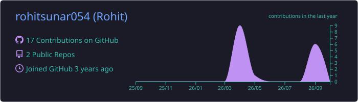
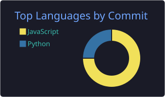
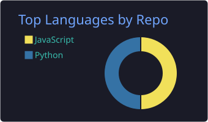
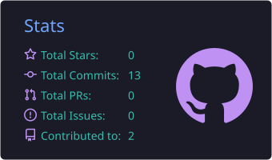

<h1 align="center">Hi 👋, I'm Rohit Sunar</h1>

<h3 align="center">
Python Full Stack Developer | Python • Django • DRF • React
</h3>

  
  

---

## 👨‍💻 About Me

- 🔭 Currently building **DriveEase** (car rental platform)
- 🌱 Learning **Django REST Framework, React.js & Docker**
- 👯 Open to collaborate on **Trendmart**
- 💬 Ask me about **Python, Django & REST APIs**
- 📫 Reach me: **[rohitsunar054@gmail.com](mailto:rohitsunar054@gmail.com)**
- 📄 **[Resume](YAHAN_RESUME_LINK_DAALO)**
- ⚡ Fun fact: I enjoy calisthenics & coding

---

## 🛠️ Tech Stack

  

---

## 🚀 Featured Projects

<table>
<tr>
<td width="50%">

### 🛒 Trendmart
E-commerce web application with a React frontend and Django REST backend.

**Tech:** React • Django • REST API • MySQL

[View Project →](https://github.com/rohitsunar054/trendmart)

</td>
<td width="50%">

### 🚗 DriveEase
Car rental platform for browsing vehicles, filtering cars and managing bookings.

**Tech:** React • Django • REST API

[View Project →](https://github.com/rohitsunar054)

</td>
</tr>
</table>

---

## 📊 GitHub Stats

  
  

  
  

  

  

---

## 🐍 Contribution Snake

  <picture>
    <source media="(prefers-color-scheme: dark)" srcset="https://raw.githubusercontent.com/rohitsunar054/rohitsunar054/output/github-snake-dark.svg" />
    
  </picture>

---

## 🤝 Connect With Me

  
  
  

<b>💻 Code. Build. Learn. Repeat. 🚀</b>

